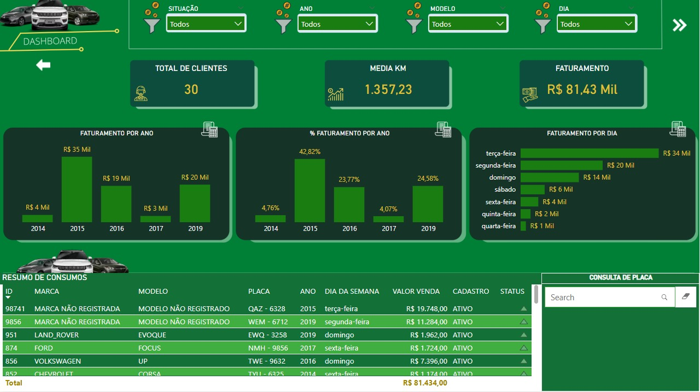
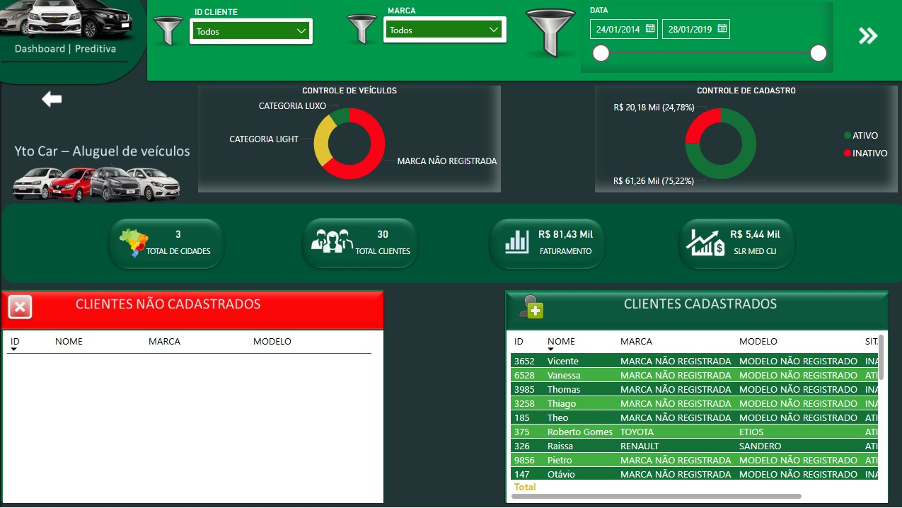
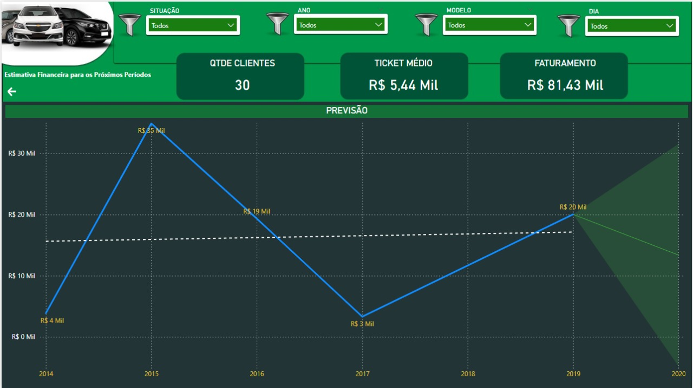

# 🚗 Dashboard – Locadora de Veículos  
Projeto desenvolvido na seção **Essentials** do curso *Aprendendo Power BI na prática + SQLServer + Interface de Dashboard com Figma*.  
O objetivo foi construir um painel completo de análise para uma locadora de veículos, utilizando transformação de dados, modelagem com JOIN e criação de indicadores essenciais.

---

## 📸 Prévia do Dashboard

### **Capa**

### **Página 1 – Dashboard Geral**

### **Página 2 – Clientes e Categorias**

### **Página 3 – Projeções**

## 📐 Modelo de Dados (Data Model)
A modelagem foi construída utilizando relacionamentos 1:* entre as principais tabelas, aplicando INNER JOIN, LEFT JOIN e LEFT ANTI no Power Query para integrar clientes, veículos, categorias e registros de consumo.

---

## 📊 Visão Geral  
Este dashboard apresenta métricas essenciais para o acompanhamento do faturamento, comportamento dos clientes e desempenho da locadora ao longo dos anos.

O projeto reforça conceitos fundamentais do Power BI, incluindo:

- **DAX** — utilizada apenas na camada de relatório para criação de medidas.  
- **Linguagem M** — utilizada no Power Query para transformação e preparação dos dados.  
- **INNER JOIN** — aplicado durante a modelagem para integrar tabelas relacionadas.  

---

## 💡 Indicadores apresentados
• Total de clientes  
• Ticket médio do cliente  
• Faturamento total (R$ 81,43 mil)  
• Média de KM rodado  
• Controle de cidades atendidas  
• Clientes cadastrados e não cadastrados  
• Faturamento por ano  
• Percentual de faturamento por ano  
• Faturamento por dia da semana  
• Distribuição por categoria de veículos  
• Controle de cadastro (ativo x inativo)  
• Projeção de faturamento  

---

## 📈 Análises do Dashboard  

• **Faturamento por ano** (incluindo variação percentual)  
• **Faturamento por dia da semana**  
• **Distribuição de veículos por categoria** (Luxo, Light, Não Registrada)  
• **Tabela completa de consumos** (marca, modelo, dia da semana, valor e situação)  
• **Clientes cadastrados x não cadastrados**  
• **Análise preditiva** do faturamento com linha histórica + projeção  
• **Segmentação por filtros**: situação, ano, modelo, dia, cliente, marca, data  

---

## 🛠️ Recursos utilizados

- **Power BI Desktop**
- **Power Query (Linguagem M)**
- **DAX** para medidas:  
  - `FAT` (faturamento total)  
  - `MEDIA_KM`  
  - `QTD_CLIENTES`  
  - `TICKET_MEDIO`  
- **Modelagem** com:  
  - INNER JOIN  
  - Tabelas de clientes, veículos, consumos e KM  
- **Interface visual** baseada no design aplicado pelo curso  
- **Análise Preditiva** usando visual de linha com projeção  

---

## 📁 Estrutura do Repositório

📂 powerbi-locadora-veiculos
├── capa-dashboard.png
├── dashboard-page1.png
├── dashboard-page2.png
├── dashboard-page3.png
├── modelo.png
├── locadora-de-veiculos.pbix
└── README.md

---

## 🎯 Aprendizados conquistados  
• Diferença clara entre **DAX** e **Linguagem M**  
• Integração entre tabelas utilizando JOIN  
• Construção de KPIs relevantes para negócios  
• Análise preditiva simples  
• Storytelling com dados  
• Publicação profissional de projetos no GitHub  

---

## 🚀 Sobre mim  
Este projeto faz parte da construção do meu portfólio na área de **Análise de Dados e BI**, colocando em prática boas práticas de modelagem, visualização e documentação profissional.
